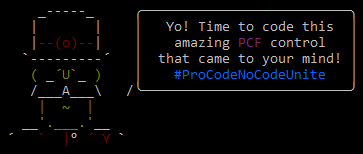

# generator-pcf  


> Yeoman generator to kickstart your Power Apps Component Framework project.

## Prerequisites

First of all you need to install [Power Apps CLI](https://docs.microsoft.com/en-us/powerapps/developer/common-data-service/powerapps-cli#install-power-apps-cli) which is must-have for PCF development.

Secondly, make sure that you add MSBuild to your path variable.

The location where you can find it if you have Visual Studio 2017 installed:

```
C:\Program Files (x86)\Microsoft Visual Studio\2017\Professional\MSBuild\15.0\Bin\
```

or maybe if you have Visual Studio 2019:

```
C:\Program Files (x86)\Microsoft Visual Studio\2019\Preview\MSBuild\Current\Bin
```

## Usage

First, install [Yeoman](http://yeoman.io) and generator-pcf using [npm](https://www.npmjs.com/) (we assume you have pre-installed [node.js](https://nodejs.org/)).

```bash
npm install -g yo
npm install -g generator-pcf
```

Then generate your new project by answering the prompts:

```bash
yo pcf --force
```

or just passing the command line arguments:

```bash
yo pcf --ns Fic --n SuperCoolControl --t field --pkg 2 --pp fic --pn IvanFicko --force
```

## Options

| Name             | Alias | Type   | Description                                                  | Required | Default   |
| ---------------- | ----- | ------ | ------------------------------------------------------------ | -------- | --------- |
| skip-msbuild     | sb    | bool   | Do not run MSBuild at end                                    | NO       | false     |
| force            |       | bool   | Overwrite all files                                          | NO       | false     |
| controlNamespace | ns    | string | Control Namespace                                            | NO       | undefined |
| controlName      | n     | string | Control name                                                 | NO       | undefined |
| controlTemplate  | t     | string | Choose control template:<ul style="margin-bottom:0"><li>field</li><li>dataset</li></ul> | NO       | undefined |
| npmPackage       | pkg   | int    | Additional NPM packages:<ul style="margin-bottom:0"><li>0 = None</li><li>1 = React</li><li>2 = React + Fluent UI</li></ul> | NO       | undefined |
| publisherPrefix  | pp    | string | Publisher prefix for solution                                | NO       | undefined |
| publisherName    | pn    | string | Publisher name for solution                                  | NO       | undefined |

**\* All options that will be undefined will result in a prompt for that value**

## Features

 * Creates basic PCF project like Power Apps CLI
 * Adds sample files (RESX, CSS, preview image, ...)
 * Installs additional NPM dependencies
 * Initializes Power Apps solution

## Release notes

### 1.3.0

- Features
  - You can now generate README file from control metadata by calling **pcf:readme** sub-generator

### 1.2.5

- Enhancements
  - You can now pass multiple LCIDs via command line parameter

### 1.2.4

- Bugfixes
  - Fixed bug you try to add RESX file in a project that is not created with PCF Generator

### 1.2.3

- Bugfixes
  - Fixed bug when main generator is called with CLI arguments

### 1.2.2

- Features
  - **pcf:resx** now adds RESX file reference to manifest too
  - main **pcf** generator now checks the prerequisites (Power Apps CLI & MSBuild)
- Other
  - Prettified code

### 1.2.0

- Features
  - You can now add additional RESX files by **pcf:resx** sub-generator
- Other
  - Refactor using sub-generators

### 1.1.1

- Enhancements
  - Common values are now stored next run (namespace, publisher prefix & name)

### 1.1.0

- Features
  - You can now pass arguments via command line parameters

### 1.0.0

- Initial release

## License

MIT © [Ivan Ficko](https://dynamicsninja.blog)